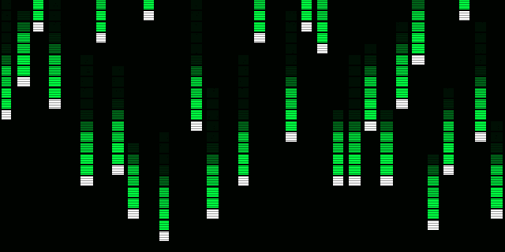

# HACK THE PLANET

> *"Systems don't change the world… people do."* — Urcuqui



A browser-based 3D first-person shooter with a **Mr. Robot / hacker aesthetic**, 8-bit Megaman X chiptune music, and a full cinematic intro sequence. Built entirely in a single HTML file using **Three.js** and the **Web Audio API** — no build tools, no dependencies beyond a CDN script.

---

## Features

| Feature | Details |
|---------|---------|
| **Cinematic Intro** | ~68-second hacker intro with 11 scenes, atmospheric audio, matrix rain, city skyline, terminal typing, cyberattack wave animation, and glitch effects |
| **3D Arena** | First-person perspective with neon-green hacker aesthetic, server-rack pillars, and pulsing corner lights |
| **Enemy AI** | State machine with patrol → chase → attack transitions and glowing eye indicators |
| **Physics** | Jump with gravity, projectile system with impact lighting |
| **8-bit Music** | Original Megaman X–style chiptune via Web Audio API — square wave lead, harmony, triangle bass, and synthetic drums. Loops seamlessly |
| **SFX** | Procedural sound effects for shooting, jumping, hits, and kill fanfares |
| **Hacker HUD** | Terminal-style overlay showing player integrity, enemy firewall health, and rotating shell commands |

---

## Controls

| Input | Action |
|-------|--------|
| `↑ ↓` | Move forward / backward |
| `← →` | Rotate left / right |
| `SPACE` | Jump |
| `Left Click` | Fire exploit (shoot) |

**Objective:** First to 3 kills wins. Eliminate the PandeCorp drone to gain root access.

---

## How to Run

No server required. Just open the file in a browser:

```bash
git clone https://github.com/curcuqui/game-AI.git
cd game-AI
open index.html        # macOS
xdg-open index.html    # Linux
start index.html       # Windows
```

Or drag `index.html` directly into any modern browser (Chrome, Firefox, Edge, Safari).

---

## Intro Scenes

The cinematic plays automatically on load. Click or press any key to begin.

| Scene | Visual | Narrative Beat |
|-------|--------|---------------|
| 1 | Matrix rain building up | *"In a world where data is the new currency…"* |
| 2 | Neon city skyline | *"One corporation rose above them all."* |
| 3 | Surveillance scan line | *"They promised security… They delivered control."* |
| 4 | Binary data stream | *"But every system has a weakness."* |
| 5–6 | Terminal typing live | Commands: `BYPASS FIREWALL [OK]` → `USER: URCUQUI` → `ROOT GRANTED` |
| 7 | Fast montage flashes | *"Not a criminal… A liberator."* |
| 8 | World map lighting up | *"With code as his weapon… truth as his payload…"* |
| 9 | Cyberattack wave | **"Hack. The. Planet."** |
| 10 | Character quote | *"Systems don't change the world… people do."* |
| 11 | Logo shatter + title | **HACK THE PLANET** |

Press `[ SKIP ]` (bottom-right) to go straight to the menu.

---

## Tech Stack

- **Three.js r128** — 3D rendering, scene graph, fog, shadow maps
- **Web Audio API** — Procedural chiptune engine (no audio files)
- **HTML5 Canvas 2D** — Intro cinematic animations
- **Vanilla JS / CSS** — HUD, overlays, scanline effect, glitch animations

---

## Project Structure

```
game-AI/
├── index.html    # Entire game — intro + engine + logic (~1 200 lines)
├── preview.gif   # Animated README preview
└── README.md
```

---

## Enemy States

The PandeCorp drone uses a three-state finite state machine:

```
PATROL ──(dist < 18)──► CHASE ──(dist < 8)──► ATTACK
                    ◄──(dist > 22)──     ◄──(dist > 11)──
```

Eye color indicates current state:
- 🟢 **Green** — Patrolling
- 🟡 **Yellow** — Chasing
- 🔴 **Red** — Attacking (fires every 1.2 s with spread)

---

## Audio Engine

The chiptune system schedules Web Audio oscillator nodes ahead of time for glitch-free looping:

```
Channel 1 — Square wave (lead melody)     BPM: 158
Channel 2 — Square wave +7 cents (chorus)
Channel 3 — Triangle wave (bass line)
Channel 4 — Noise bursts (kick/snare/hihat)
```

The music auto-starts on the first user interaction and can be toggled with the `♪ BGM` button in the HUD.

---

## License

MIT — do whatever you want with it.

> *The system is watching. Are you ready to break it?*
